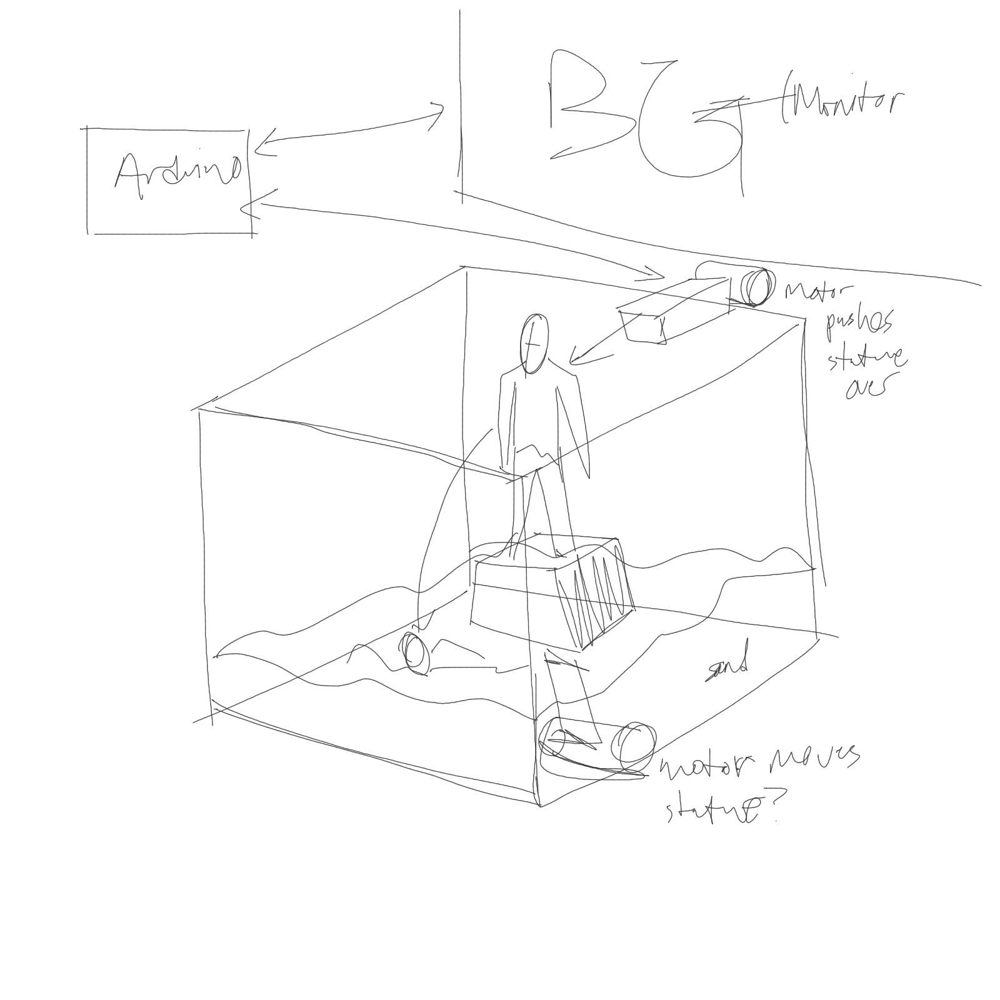

# Development Journal

## Proposal

For this project, I would like to have a robot that performs/interprets Percy Bysshe Shelley's Ozymandias:

```
I met a traveller from an antique land
Who said: Two vast and trunkless legs of stone
Stand in the desert. Near them, on the sand,
Half sunk, a shattered visage lies, whose frown,
And wrinkled lip, and sneer of cold command,
Tell that its sculptor well those passions read
Which yet survive, stamped on these lifeless things,
The hand that mocked them and the heart that fed:
And on the pedestal these words appear:
'My name is Ozymandias, king of kings:
Look on my works, ye Mighty, and despair!'
Nothing beside remains. Round the decay
Of that colossal wreck, boundless and bare
The lone and level sands stretch far away.
```

I was strongly affected by [this animated interpretation](https://www.youtube.com/watch?v=sPlSH6n37ts) of Ozymandias, but I would like to visually deviate from this animation and instead provide my own robotic interpretation. So far in my brainstorms, I want the robot to "build" the scene rather than perform within the scene outright. Likely, the robot would be the one to construct and knock down the statue, as well as interface with Processing to display background images and transition them accordingly.

For dramatic affect, I may want to have the robot "break" loudly in some way alongside the breaking of the statue. I am still unsure if I should use the previously-linked audio or record my own voiceover, but if I go with my own voiceover I will likely alter/post-process it in some way that allows a more "ominous" or "bassy" effect. I will likely use sand in some form, perhaps paired with a light fan I happen to have to simulate wind blowing.


