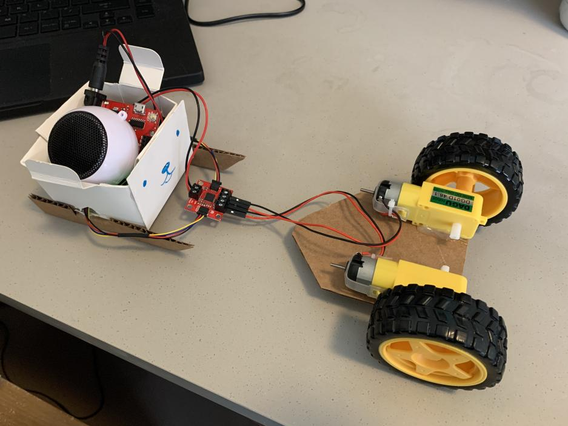
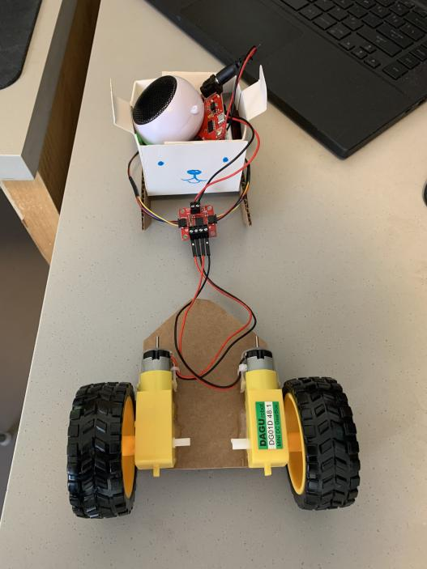
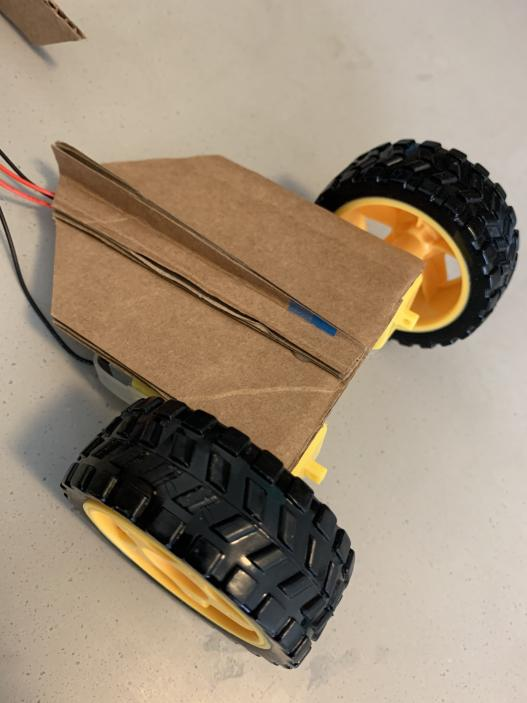
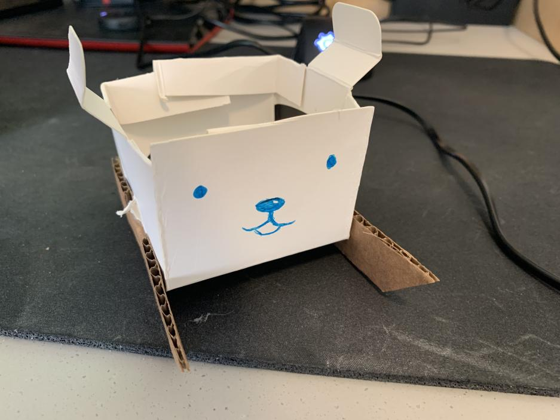
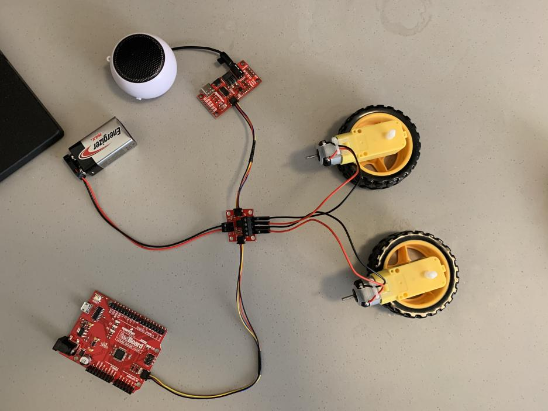

# An Odd Robot Sled

For this project, I decided to try experimenting with a weird design which involved using the electronic circuitry as part of the structure. The robot consists of 2 parts: a sled and a machine that pulls the sled. The sled itself houses the Redboard, the MP3 controller, speaker, and batteries; the machine dragging the sled is merely 2 wheels and a cardboard chassis. The motor controller connects the machine to the Redboard and other QWIIC components via wires placed to look like hands, harnesses, and reins. I was not entirely confident in the strength of the wires; accordingly, I made sure the machine would move more slowly and in a wide circle to relieve tension on the wires themselves. During this pathing, the robot will also loop [this song from Animal Crossing](https://www.youtube.com/watch?v=P2hqs1eelm8).

## Gallery

Finished work. Batteries and MP3 trigger are stowed underneath the Redboard.

Exposed underbelly of the machine. The underfin acts as a stabilizer, somewhat similar to a boat rudder or a tricycle third wheel.

Closer look at rider itself. The box itself is folded from a thin cardboard/thick paper package, with cut slots at the sides for the wire "arms." Sled "blades" are glued at the bottom to reduce side-to-side drift.

Circuitry prior to assembly.

## Problems

I am not too sure of the *exact* cause, but the motor portion of the robot is nonfunctioning. I have tested and narrowed down the potential causes to either an issue with the motor driver or the motors themselves. Everything else works fine.
