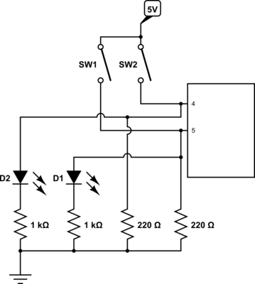

# 2 Buttons + 2 LEDs Circuit

This circuit contains 2 pushbuttons, each of which when pressed will create different alternating LED patterns. Button 1 will alternate the LEDs at a regular interval of 100 seconds. Button 2 will alternate the LEDs at random intervals between 100 and 500 seconds. The "randomness" is achieved by hooking `randomSeed()` into an empty pin 0, then generating pseudorandom numbers from there.

## Schematic

## Problems/Solutions

N/A
