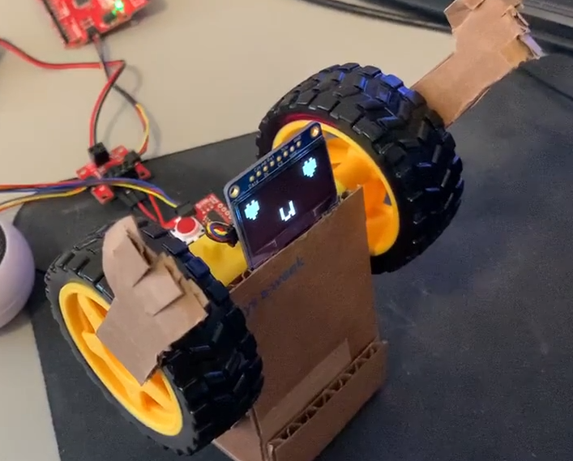

# Robomeo's Monologue - II ii 2

[Performance](https://streamable.com/wcga1y)



For this project, I decided to make my robot reenact Romeo's monologue from *Romeo and Juliet*:

```
But, soft! what light through yonder window breaks?
It is the east, and Juliet is the sun.
Arise, fair sun, and kill the envious moon,
Who is already sick and pale with grief,
That thou her maid art far more fair than she:
Be not her maid, since she is envious;
Her vestal livery is but sick and green
And none but fools do wear it; cast it off.
It is my lady, O, it is my love!
O, that she knew she were!
She speaks yet she says nothing: what of that?
Her eye discourses; I will answer it.
I am too bold, 'tis not to me she speaks:
Two of the fairest stars in all the heaven,
Having some business, do entreat her eyes
To twinkle in their spheres till they return.
What if her eyes were there, they in her head?
The brightness of her cheek would shame those stars,
As daylight doth a lamp; her eyes in heaven
Would through the airy region stream so bright
That birds would sing and think it were not night.
See, how she leans her cheek upon her hand!
O, that I were a glove upon that hand,
That I might touch that cheek!
```

For this project, I shifted my focus towards the motors, trying to make them more precise/consistent for subtler arm motions. I managed to get what I feel is a satisfactory level of precision that hopefully mimics the grand arm movements of human actors who reenact this scene. In addition, I opted to use an asynchronous `millis()`-based timing system rather than the synchronous (blocking) `delay()` system for easier syncing of movement cues with the audio track. This allowed me to fine-tune pauses and expressions in the audio track separately from the code, making it somewhat more convenient for me to play around with movements.

For the audio track, I recorded a TTS playback of the script as an MP3, then edited the file with pauses to allow some more room for motions. During editing, I also changed the talking speed at certain points to reduce the odd pacing that the TTS sometimes had when speaking the lines.

In terms of display, one trade-off with the way I implemented the asynchronicity was that it made precisely timing facial cues much more difficult than usual. To compensate, I simplified the movements themselves and reduced the amount of movement that the faces would undergo throughout the performance. Luckily, I managed to figure out how to display certain characters that I was unable to display before, which was useful for conveying a wider range of emotions with my simplified expressions. 

Since this is a monologue, the props I used were relatively minimal; however, I found that my computer monitor with an image of Juliet on the balcony conveyed the lighting and positioning that Romeo was referring to. I initially was also planning on saying Juliet's subsequent lines, but due to time constraints as well as lack of faith in my acting abilities, I eventually decided against pursuing this idea.
